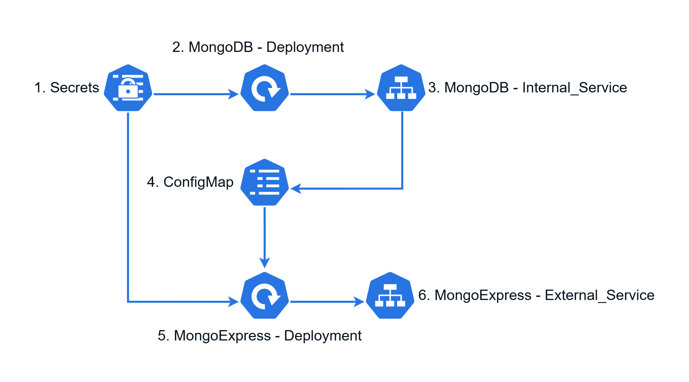

# 🚀 Kubernetes Deployment — MongoDB & Mongo-Express

> A lightweight Kubernetes setup demonstrating a stateful MongoDB database with persistent storage and a Mongo-Express UI.

## 🏗️ Architecture Flow

  

## 📌 Project Overview
- This project deploys **MongoDB** and **Mongo-Express** on Kubernetes using a clean and modular structure.  
- MongoDB uses **PersistentVolume + PersistentVolumeClaim** to ensure data remains intact even during pod restarts.  
- Configuration is managed through a **ConfigMap**, while credentials are securely stored using **Secrets**.  
- Mongo-Express connects internally to MongoDB through a service and provides a simple web-based UI.

## 🎯 What This Project Demonstrates
- Running a **stateful database** on Kubernetes  
- Clean separation of configuration and sensitive data  
- Persistent storage handling  
- Internal service-to-service communication  
